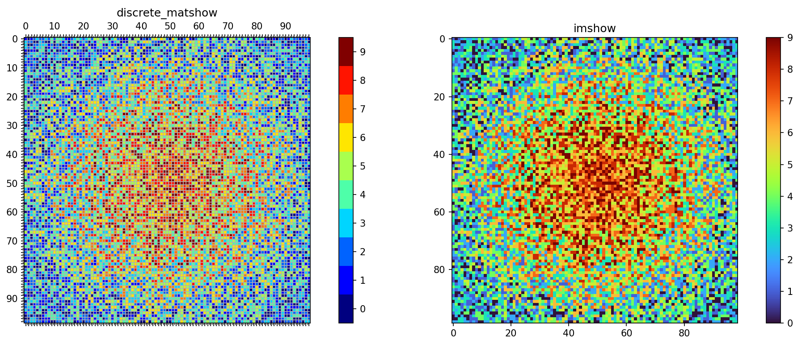
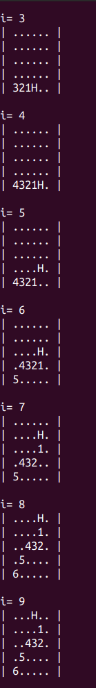
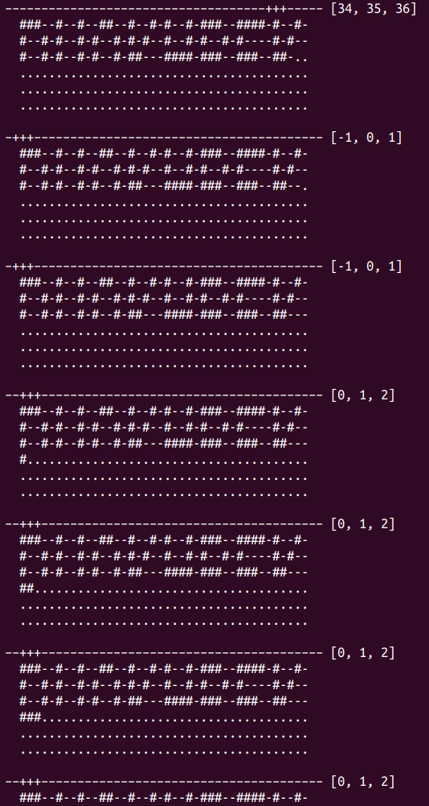
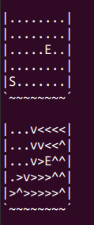
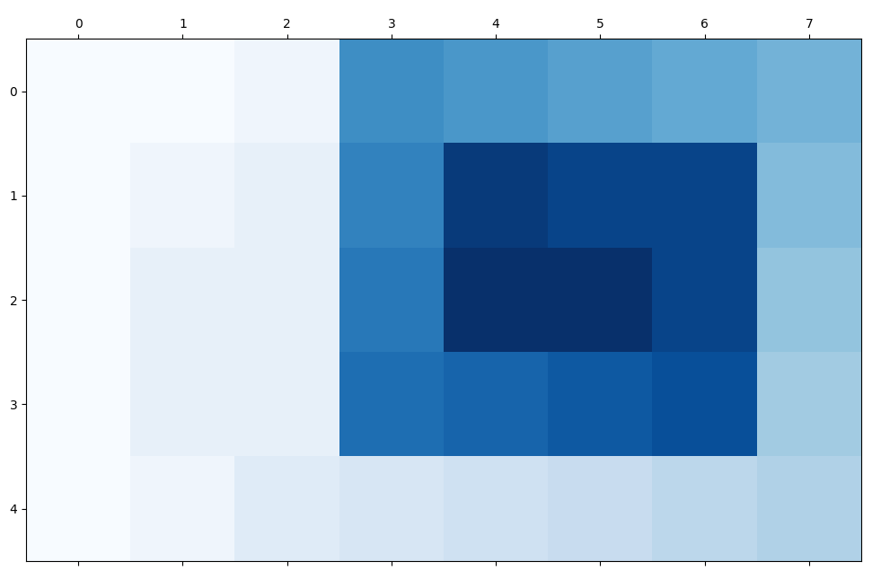
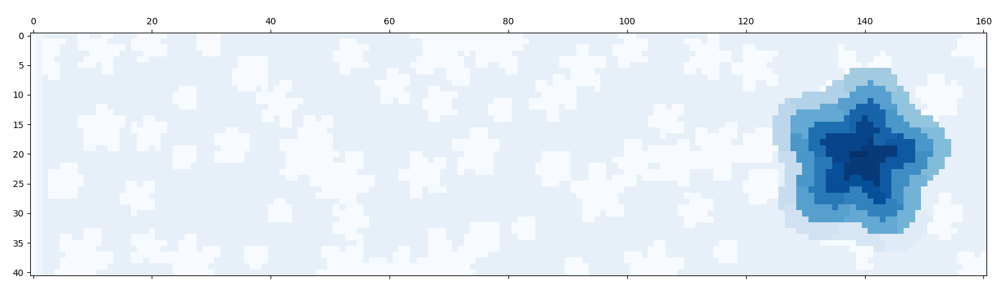
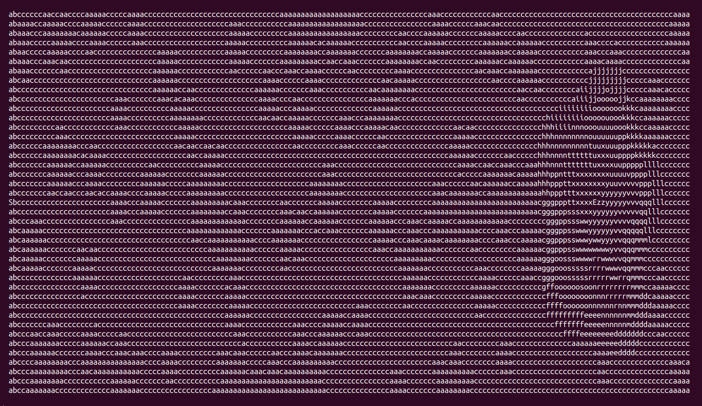
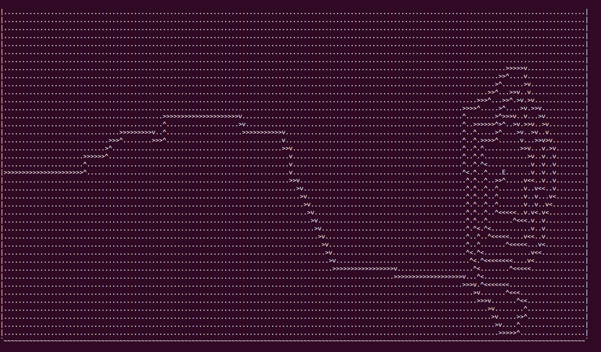
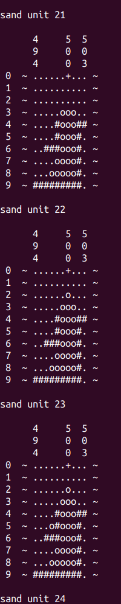
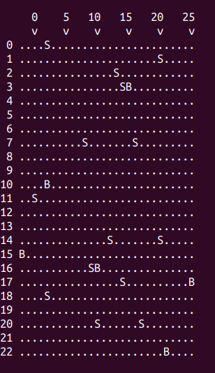

# Solutions to Advent of Code 2022

Here a few sample screenshots of the programs at work:

`aoc_08`|`aoc_09`
:------:|:------:
 | 

`aoc_10`|`aoc_12_1`|`aoc_12_2`
:------:|:--------:|:---------:
 |  | 

`aoc_12_3`|`aoc_12_4`|`aoc_12_5`
:--------:|:--------:|:--------:
 |  | 

`aoc_14`|`aoc_15`
:------:|:------:
 | 

